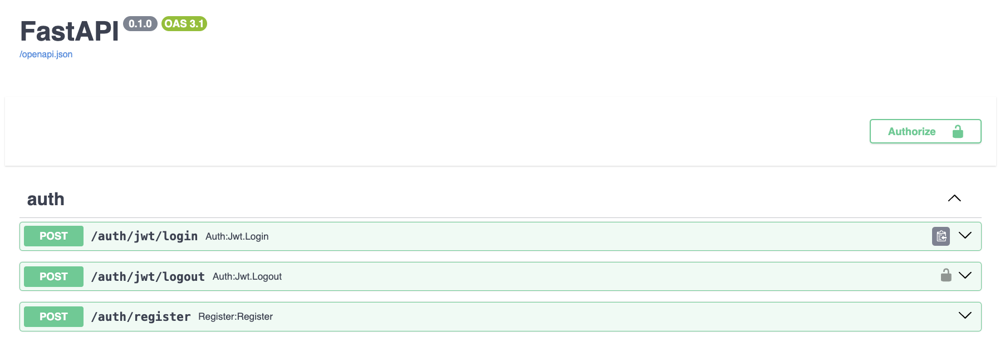
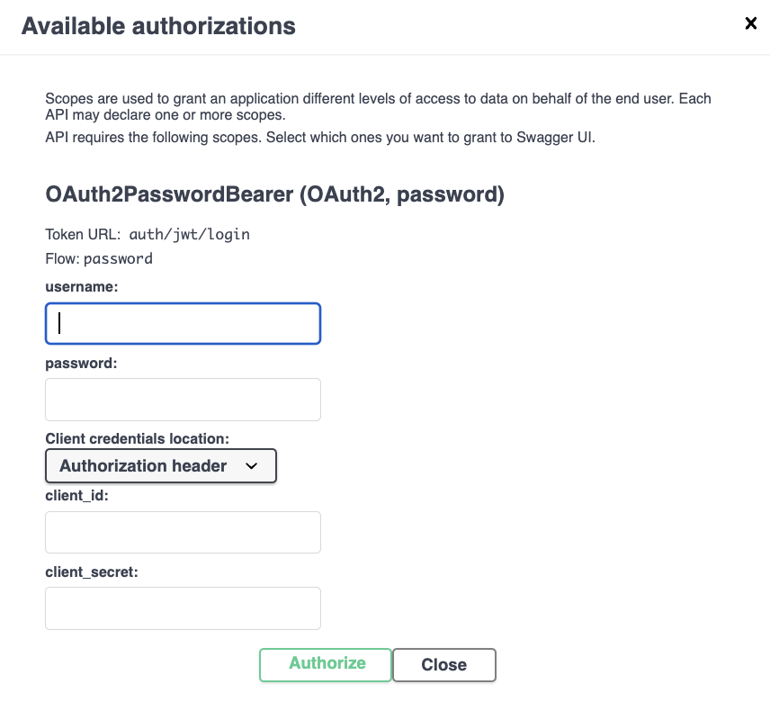
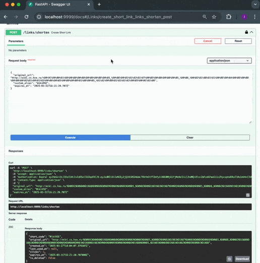
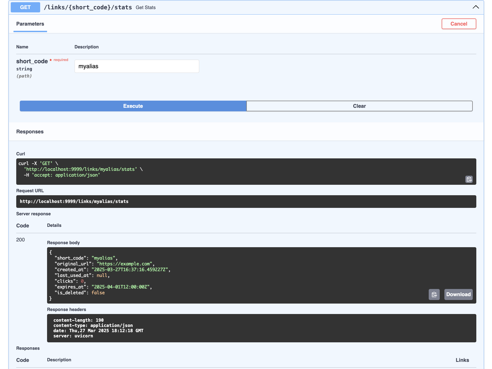

# Сервис Fast API по сокращению ссылок

## Функционал сервиса
### Авторизация

#### `POST /auth/register` — регистрация нового пользователя
Для регистрации необходимо ввести свою почту и пароль
#### `POST /auth/jwt/login` — логин (выдача токена для доступа)
Данный метод позволяет получить уникальный токен для дальнейшего использования других методов API, которые требуют регистрации
#### `POST /auth/jwt/logout` — логаут
Метод позволяет удалить текущий токен доступа пользователя
#### Особенности использования 
Только два из трех методов могут быть использованны в Swagger UI, а именно `/register` и `/login`. Причем метод `/login` работает неполноценно, так как он выдает только токен для дальнейшего использования методов вне Swagger UI. Например его можно использовать, чтобы разлогиниться:
<pre>
POST /auth/jwt/logout
Authorization: Bearer <токен>
</pre>

При этом можно использовать кнопку Authorize, чтобы ввести свою почту и пароль для того, чтобы в дальнейшем воспользоваться функциями, которые доступны только для авторизированных пользователей.

### Сокращение ссылок

#### `POST /links/shorten` — создать новую короткую ссылку
Этот метод позволяет пользователям создать свою сокращенную ссылку. Однако для незарегистрированных пользователей существуют некторые ограничения. Они не могут задавать свое собственное название ссылки и не могут задавать срок жизни ссылки. Ссылка для таких пользователей получает случайное уникальное названи из 8 случайных латинских букв и цифр и работает только в течении 7 дней. Пример ввода для получения ссылки:

<pre>
POST /links/shorten
{
  "original_url": "https://example.com",
  "custom_alias": "myalias",
  "expires_at": "2025-12-31T23:59:00Z"
}
</pre>

Стоит отметить, что зарегистрированные пользователи могут создавать ссылки любого срока действия. Однако для того, чтобы ссылки были активными необходимо как минимум 1 раз в 30 этими ссылками пользоваться. В обратном случае данные ссылки становятся неактивными.

#### `GET /links/{short_code}` — перейти по короткой ссылке 
Данный метод позволяет перейти по короткой ссылке, которая есть в базе данных. Для примера создадим короткую ссылку на Wiki курса, которая довольно громоздкая. Пример:

Стоит отметить, что данный метод не работает через Swagger UI.

#### `GET /links/{short_code}/stats` — получить статистику конкретной ссылки
Метод позволяет получить статистику по любой ссылке, если ее название известно. Пример:

#### `PUT /links/{short_code}` — обновить существующую короткую ссылку
Метод, который могут использовать только авторизированные пользователи и только на своих ссылках. Данный метод позволяет пользователю сменить оригинальную ссылку для короткой ссылки.
#### `DELETE /links/{short_code}` — удалить короткую ссылку
Метод, который могут использовать только авторизированные пользователи для удаления свои коротких ссылок. Довольно важным является то, что удаленные или истекшие ссылки с заданными названиями могут быть использованы тем же или другим пользователем заново.
#### `GET /links/my/` - информация об активных коротких ссылках
Данный метот позволяет авторизированному пользователю статистику только по его активным коротким ссылкамю
#### `GET /links/expired` — список всех ссылок с истёкшим сроком
Этот метод выводит статистику по удаленным или истекшим ссылкам авторизированного пользователя. Причем, если название удаленной ссылки уже занял другой пользователь, то этой ссылки не будет в списке.
#### `GET /links/search/` — поиск по исходному URL
Метод позволяет любому пользователю найти короткую ссылку на нужный ему сайт, если она есть в базе данных.

### Примеры защищённых и незащищённых эндпоинтов
Данные методы нужны, чтобы проверить смогли ли вы войти в свой аккаунт в сервисе или нет.
#### `GET /protected-route` — доступен только для залогиненного пользователя
#### `GET /unprotected-route` — общедоступный эндпоинт

### Дополнительная информация про удаление и приостановку действия ссылок.
Ссылки считаются удаленными или истекшими только после перезапуска сервиса или БД.

## Инструкция по запуску сервиса
Для того, чтобы запустить сервис локально необходимо проделать следующие шаги
- клонировать этот репозиторий на свой компьютер. Пример:

<pre>
git clone https://github.com/inreleppik/fast_api_short_link.git
cd fast_api_short_link
</pre>

- создать файл `.env` c помощью значений из `env_example.txt`;
- скачать Docker;
- запустить в терминале `docker-compose up --build`;
- приложение будет доступно по адресу http://localhost:9999 или по адресу с документацией http://localhost:9999/docs.

Крайне не рекомендуется запускать приложение через питон, так как оно было переработано под докер и не факт, что там запустится.

## Описание базы данных

В качестве базы данных используется PostgreSQL 16 и две основные таблицы:

**user**
- id (UUID) — первичный ключ
- email (строка, уникальная)
- hashed_password (строка)
- is_active (bool)
- is_superuser (bool)
- is_verified (bool)

**short_links**
- id (int) — первичный ключ
- short_code (строка, уникальная) — название короткой ссылки
- original_url (строка) — исходный длинный URL
- created_at (datetime)
- last_used_at (datetime)
- expires_at (datetime) — дата истечения срока действия
- clicks (int) — счётчик переходов
- is_deleted (bool) — пометка, удалена ли ссылка
- user_id (UUID, ссылка на user.id)